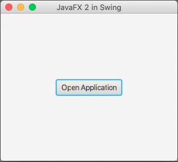
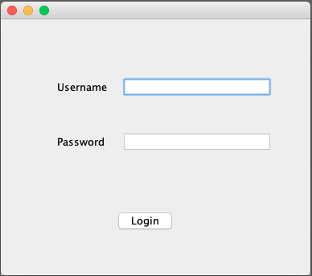
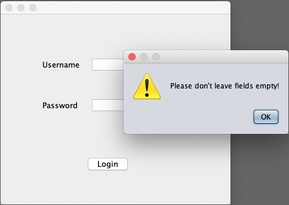
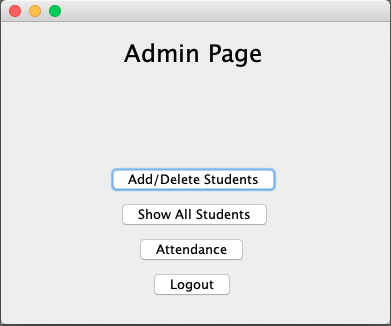
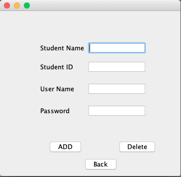
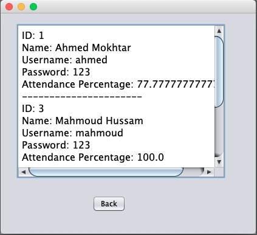
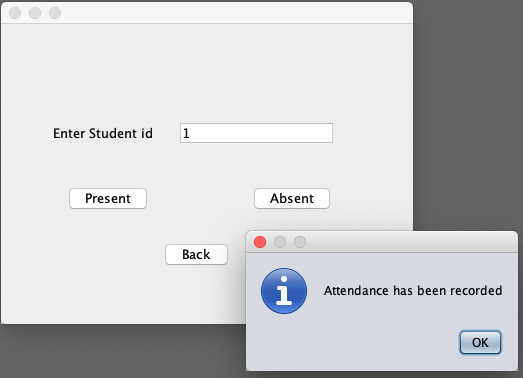

# Attendance-Management-System

application starts with simple form:

Login Form:

Validating user input based on stored data(in txt file):

Admin page:

Adding/Deleting students:

Showing the data of all exsisting students:

Admin can mark student as absent or present:

 
Student can see his attendance percentage and shows warning ig the absent percentage is 20% or more:

